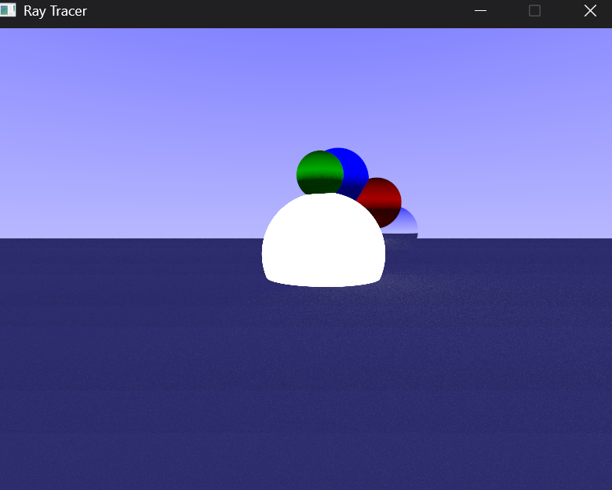
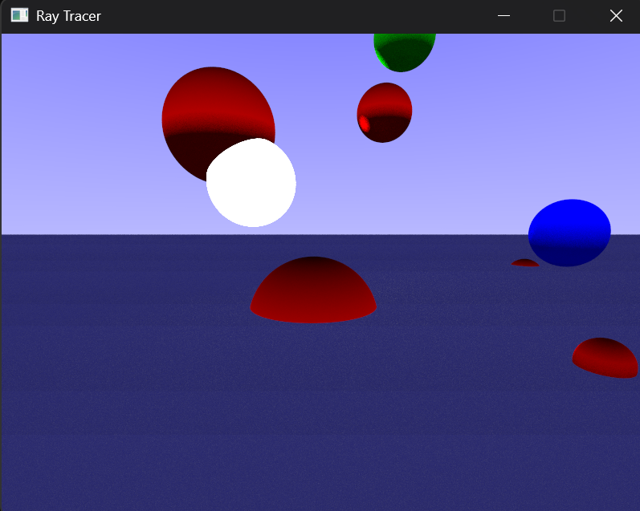
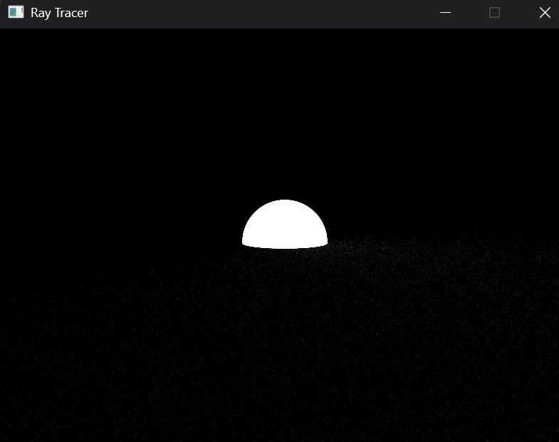

# RayTracer
Created for my Computer Graphics class. This program is able to render simple spheres with their own textures using a ray-tracing pipeline.

## Features
* Capable of rendering simple objects (spheres and planes) using Lambertian, metallic, and emissive materials.
* Implements ambient occlusion and multiple bounce reflections for added realism.

## Installation
1. Download [SDL3](https://github.com/libsdl-org/SDL/releases/tag/release-3.2.28)
2. Also maybe get your hands on [OpenGL](https://www.opengl.org/) and [GLM](https://github.com/g-truc/glm)
3. Add the .dll files to Build.

## Usage
* Run the project through Visual Studio. For better performance, changing to Release is highly recommended.

## Technical Details
* There is very simple anti-aliasing through the ability to choose how many sample sizes you wish to run with when calling the scene.
* Multiple materials exist; Light is emissive and leaves some light behind, and metal gets a reflection of the sky and other nearby objects.

## Attribution
Credit goes to OpenGL, SDL3 and the GLM library expansion.

## Conclusion
Feel free to make a fork if you wish. One big thing I wanted to get to was to have triangles drawn so you could eventually import advanced models, but it could possibly be done by you!
